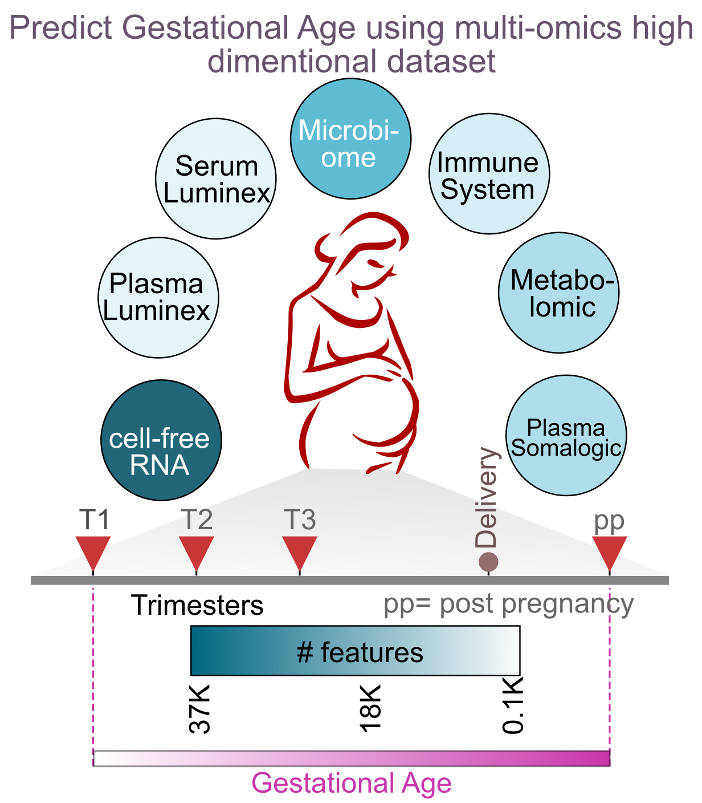

# challengeLab-ML
Challenge Lab : ML in public health and genomics.

In this assignment, students need to predict "Gestational Age" of women based on the 7 multi-omics high-dimensional datasets as illustrated below. Train data consist of 14 women. Students will be using various machine learning or deep learning (regression) models to predict the Gestational Age of 3 women using multi-omics datasets. We will assess the performance of the students based on 1) Novelty of the algorithm (50) and 2) MAE [Mean Absolute Error] (50).

# Original article
[Multiomics modeling of the immunome, transcriptome, microbiome, proteome and metabolome adaptations during human pregnancy](https://academic.oup.com/bioinformatics/article/35/1/95/5047759/)
# Contact
email id : rintu.kutum@igib.in
contact number: 7838369344
# Theme
- Expose students to challenging problems in public health.
- Allow students to team-up and solve these problems via machine learning and deep learning models.

# About
- [[Preterm birth]](https://www.who.int/news-room/fact-sheets/detail/preterm-birth)
- [[Preterm birth (premature birth)]](https://www.nhp.gov.in/disease/reproductive-system/female-gynaecological-diseases-/preterm-birth)
- [[Extremely Preterm Birth]](https://www.acog.org/Patients/FAQs/Extremely-Preterm-Birth)
- [[Setting research priorities to improve global newborn health and prevent stillbirths by 2025]](https://www.ncbi.nlm.nih.gov/pmc/articles/PMC4576458/pdf/jogh-06-010508.pdf)
- [[Preterm birth: Case definition & guidelines for data collection, analysis,and presentation of immunisation safety data]](https://www.ncbi.nlm.nih.gov/pmc/articles/PMC5139808/pdf/main.pdf)

# About challenge
To build ML/DL models to predict gestational age (GA) from temporal high-dimentional
datasets (immunome, transcriptome, microbiome, proteome and metabolome).

# About data

- [Gestational Age](https://www.ncbi.nlm.nih.gov/pubmed/24764329)
- [Cell-free RNA transcriptome]
  Cell-free RNA (CfRNA) was extracted from 1 mL of plasma using Plasma/SerumCirculating RNA and Exosomal Purification kit (Norgen, cat 42800) followingmanufacture  instruction.   The  residue  of  DNA  was  digested  using  Baseline-ZERO DNase (Epicentre) and then cleaned by RNA Clean and Concentrator-5kit (Zymo).  RNA was eluted to 12 ul in elution buffer.One half of the eluted RNA was used for sequencing library preparation us-ing SMARTer Stranded Total RNAseq-Pico Input Mammalian kit (Clontech)according to the manufacturer’s manual.  Short read sequencing was performedusing the Illumina NextSeq (2×75 bp) platform to the depth of more than 10million reads per samples.  The sequencing reads were mapped to human refer-ence genome (hg38) using STAR aligner.  Duplicates were removed by Picardand then unique reads were quantified using htseq-count.
- [Proteome]
  Blood was collected into EDTA tubes, put on ice, centrifuged within 60 min-utes, and plasma was stored at−80◦C until further processing.  A first analysiswas performed in the Human Immune Monitoring Center (HIMC) at StanfordUniversity using a standard,  human 62-plex kit from eBiosciences/Affymetrix(San  Diego,  CA)  according  to  the  manufacturer’s  recommendations.  
- [Microbiome]
  Whole  genomic  DNA  was  extracted  from  each  vaginal  swab  by  means  ofthe PowerSoil DNA isolation kit (MO BIO Laboratories) according to the man-ufacturer’s  protocol
- [Immunome]
  Whole blood samples were stimulated for 15 min with either LPS, IFNα, a cock-tail containing IL-2 and IL-6, or left unstimulated.  
- [Untargeted Metabolome]
  Metabolites were extracted from plasma and analyzed using a broad coverageuntargeted  metabolomics  platform  as  described  [previously](https://www.ncbi.nlm.nih.gov/pubmed/25787789)  
