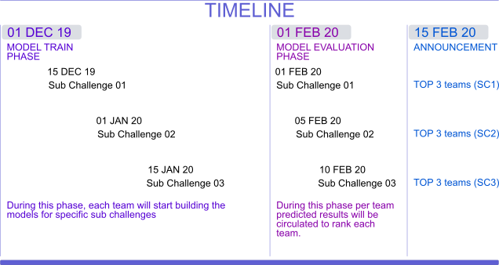

# ChallengeLab-ML
Challenge Lab : ML in public health and genomics.

In this assignment, students need to predict "Gestational Age" of women based on the 7 multi-omics high-dimensional datasets as illustrated below. Train data consist of 14 women. Students will be using various machine learning or deep learning (regression) models to predict the Gestational Age of 3 women using multi-omics datasets. We will assess the performance of the students based on :-  
 1) Novelty of the algorithm (50)  
 2) MAE [Mean Absolute Error] (50).

# Original article
[Multiomics modeling of the immunome, transcriptome, microbiome, proteome and metabolome adaptations during human pregnancy](https://academic.oup.com/bioinformatics/article/35/1/95/5047759/)

# Contact
Email id : rintu.kutum@igib.in  
Contact number: 7838369344

# Theme
- Expose students to challenging problems in Public Health.
- Allow students to team-up and solve these problems via Machine Learning and Deep Learning models.

# About challenge
To build ML/DL models to predict gestational age (GA) from temporal high-dimentional
datasets (immunome, transcriptome, microbiome, proteome and metabolome).

We have formulated the challenge into 3 sub-challeneges as mentioned below :-

### Sub Challenge 01:
- Predict GA using [Immunome](https://github.com/rintukutum/challengeLab-ML/blob/master/data/train/immunome.csv), [SerumLuminex](https://github.com/rintukutum/challengeLab-ML/blob/master/data/train/SerumLuminex.csv), [plasmaLuminex](https://github.com/rintukutum/challengeLab-ML/blob/master/data/train/plasmaLuminex.csv) and [plasmaSomalogic](https://github.com/rintukutum/challengeLab-ML/blob/master/data/train/plasmaSomalogic.csv) data.

### Sub Challenge 02:
- Predict GA using [cell-free RNA](https://github.com/rintukutum/challengeLab-ML/blob/master/data/train/cfRNA.csv), [metabolome](https://github.com/rintukutum/challengeLab-ML/blob/master/data/train/metabolome.csv) and [microbiome](https://github.com/rintukutum/challengeLab-ML/blob/master/data/train/microbiome.csv) data.

### Sub Challenge 03:
- Predict GA using all the datasets.

### TRAIN & TEST SET:
The details about gestational age (GA) along with train and test set is available in
[challenge-meta-information](https://github.com/rintukutum/challengeLab-ML/blob/master/data/challenge-meta-information.csv)

### Submission format

File naming (format)

[GROUP-X--SC1--MLmethod.csv](https://github.com/rintukutum/challengeLab-ML/blob/master/data/submission-format.csv)

SC1 (Sub Challenge 01)

# Timelines

# About preterm birth

 - [Preterm birth](https://www.who.int/news-room/fact-sheets/detail/preterm-birth)
 - [Preterm birth (premature birth)](https://www.nhp.gov.in/disease/reproductive-system/female-gynaecological-diseases-/preterm-birth)
 - [Extremely Preterm Birth](https://www.acog.org/Patients/FAQs/Extremely-Preterm-Birth)
 - [Setting research priorities to improve global newborn health and prevent stillbirths by 2025](https://www.ncbi.nlm.nih.gov/pmc/articles/PMC4576458/pdf/jogh-06-010508.pdf)
 - [Preterm birth: Case definition & guidelines for data collection, analysis,and presentation of immunisation safety data](https://www.ncbi.nlm.nih.gov/pmc/articles/PMC5139808/pdf/main.pdf)

# About data

- [Gestational Age](https://www.ncbi.nlm.nih.gov/pubmed/24764329)
- **Cell-free RNA transcriptome**  
   Cell-free RNA (CfRNA) was extracted from 1 mL of plasma using Plasma/Serum Circulating RNA and Exosomal Purification kit (Norgen, cat 42800) following manufacturer's  instructions.   The  residue  of  DNA  was  digested  using  Baseline-ZERO DNase (Epicentre) and then cleaned by RNA Clean and Concentrator-5kit (Zymo).  RNA was eluted to 12 ul in elution buffer.One half of the eluted RNA was used for sequencing library preparation using SMARTer Stranded Total RNA-Seq Kit v2 - Pico Input Mammalian (Clontech)according to the manufacturer’s manual.  Short read sequencing was performed using the Illumina NextSeq (2×75 bp) platform to the depth of more than 10 million reads per samples.  The sequencing reads were mapped to human reference genome (hg38) using STAR aligner.  Duplicates were removed by Picard and then unique reads were quantified using htseq-count.
- **Proteome**  
   Blood was collected into EDTA tubes, put on ice, centrifuged for 60 minutes, and plasma was stored at −80◦C for further processing.  At first analysis was performed in the Human Immune Monitoring Center (HIMC) at Stanford University using a standard human 62-plex kit from eBiosciences/Affymetrix(San  Diego,  CA)  according  to  the  manufacturer’s  recommendations.
- **Microbiome**  
   Whole  genomic  DNA  was  extracted  from  each  vaginal  swab  by  means  of the PowerSoil DNA isolation kit (MO BIO Laboratories) according to the manufacturer’s  protocol.
- **Immunome**  
   Entire blood samples were stimulated for 15 min with either LPS, IFNα, a cock-tail containing IL-2 and IL-6, or left unstimulated.    
- **Untargeted Metabolome**  
   Metabolites were extracted from plasma and analyzed using a broad coverage untargeted metabolomics platform as described  [previously.](https://www.ncbi.nlm.nih.gov/pubmed/25787789)
